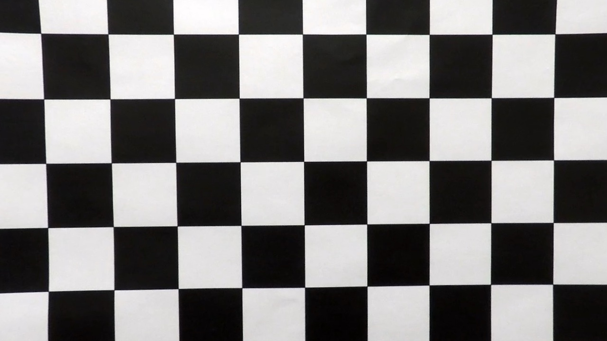
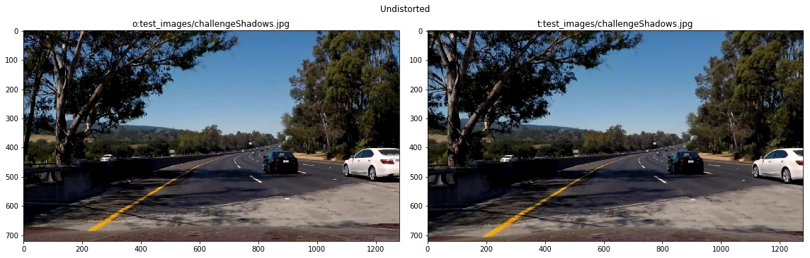
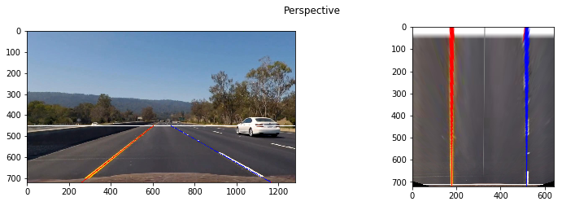
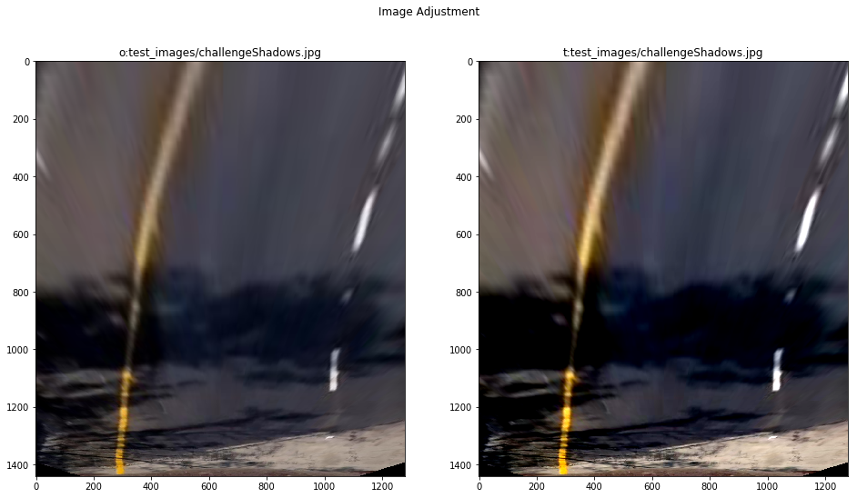
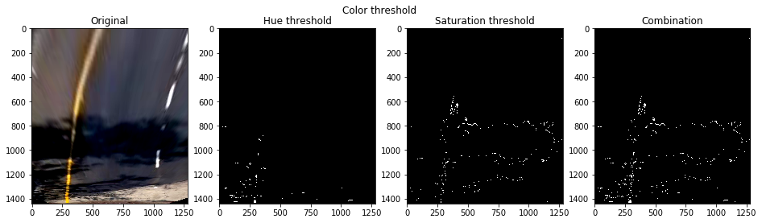
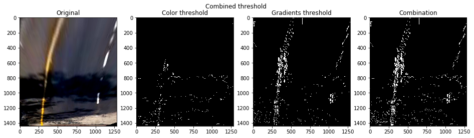
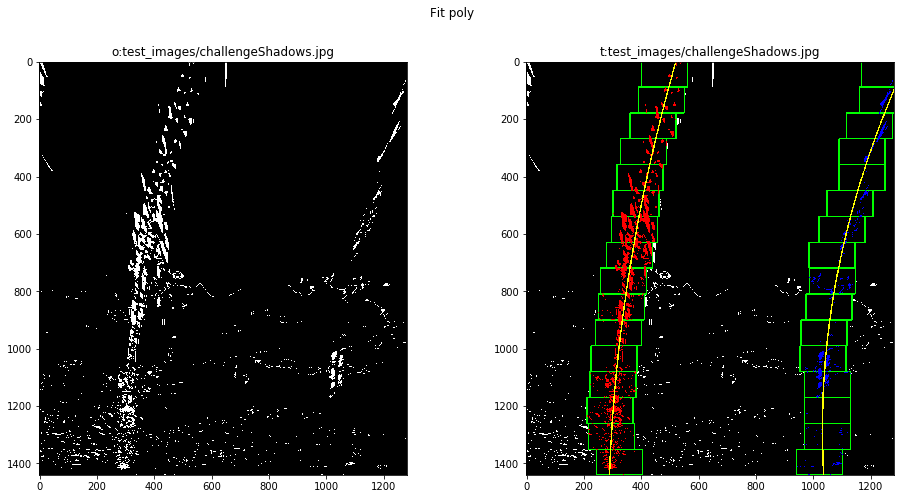
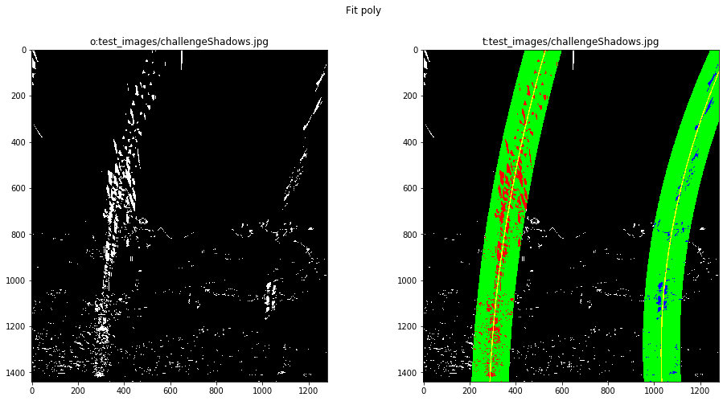
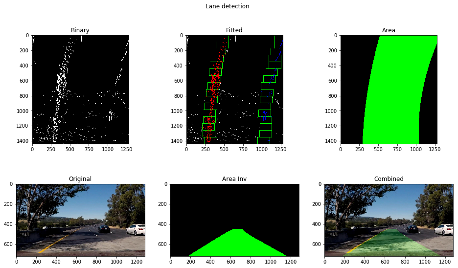

# Advanced Lane Finding Project
[](http://www.udacity.com/drive)

The goals / steps of this project are the following:

* Compute the camera calibration matrix and distortion coefficients given a
set of chessboard images.
* Apply a distortion correction to raw images.
* Use color transforms, gradients, etc., to create a thresholded binary image.
* Apply a perspective transform to rectify binary image ("birds-eye view").
* Detect lane pixels and fit to find the lane boundary.
* Determine the curvature of the lane and vehicle position with respect to
center.
* Warp the detected lane boundaries back onto the original image.
* Output visual display of the lane boundaries and numerical estimation of
lane curvature and vehicle position.

---

## Usage
### Calibration
```sh
python calibrate.py -o camera.p images
```

Produces camera matrix and distortion coefficients using given images set.
Optionally one could pass optional parameter `-g` to produces samples of
undistorted images.

### Video Pipeline
```sh
python video.py -o output.mp4 input.mp4 -b 0 -e 42
```

Processes input video by applying the pipeline. Optional parameters
`-b` and `-e` controls begin and end time of the clip.

Here's a [link to my video result](https://vimeo.com/236327973)

---

## Project Structure
* `averager.py` - averager
* `calibrate.py` - camera calibration utility
* `camera.py` - routines to load/store camera parameters
* `cv_utils.py` - various cv helpers/wrappers
* `fit.py` - polynomial fit algorithm
* `fit_policy.py` - fitting algorithm selector
* `mpp.py` - real world conversion routines
* `perspective.py` - functions related to warp perspective
* `pipeline.py` - image processing pipeline
* `threshold.py` - functions related to thresholding (both color and gradients)
* `video.py` - video conversion utility

---

### Camera Calibration

The code for this step is contained in `calibration.py:66`.  

I start by preparing "object points" template (`PATTERN_POINTS`), which will
be the (x, y, z) coordinates of the chessboard corners in the world. Here I am
assuming the chessboard is fixed on the (x, y) plane at z=0, such that the
object points are the same for each calibration image.  Thus, `object_points`
is just a replicated array of coordinates, and `object_points` will be appended
with a copy for each successfully processed input image (
`calibration.py:get_object_points()`).

`image_points` will be appended with the (x, y) pixel position of each of the
corners in the image plane with each successful chessboard detection.
Additionally all images where chessboard detection failed were reported
(`calibration.py:get_image_points()`) and used as a test images to control
quality of calibration.

I then used `object_points` and `image_points` from all images (except one)
where chessboard was detected successfully to compute the camera calibration
matrix and distortion coefficients using the `cv2.calibrateCamera()` function.

I applied this distortion correction to the test image using the
`cv2.undistort()` function and obtained this result:




### Pipeline (single images)

In the project I used the following image processing pipeline (detailed
  description could be found in `pipeline.py:apply()`):
1. Distortion correction
2. Warp perspective - I found it's useful to perform perspective transformation
before any other (adjustments, thresholding) transformations, because after
this transformation image contains only area of interest which increases overall
efficiency of the pipeline
3. Some adjustments in image brightness and contrast
4. Thresholding
   * Color thresholding
   * Gradients thresholding
   * Combination
5. Lane detection
6. Inverse warp perspective
7. Combination of original undistorted image and detected lane
8. Image annotation

#### Distortion-corrected image

To demonstrate this step, I will describe how I apply the distortion correction
to one of the test images like this one.


This step as simple as applying `cv2.undistort()` routine with previously
detected camera matrix and distortion coefficients.

#### Perspective transform

The code for my perspective transform includes a couple of functions called
`forward()` and `backward()`. Which appears in lines 39 through 47 in the file
`perspective.py`.
Both functions take as inputs an image (`image`) and uses pre-calculated
matrixes to perform transformation. The only difference for those functions
is destination image size calculations.  
I chose the hardcode the source and destination points in the following manner:

```python
SCALE = 0.75 # used to narrow the lane a bit and make it easy to fit bigger curves

TD = 37 # top delta
TXR = 10 # top extra delta for the right lane
BD = 379 # bottom delta
BXR = 146 # bottom extra delta for the right lane

half_x = shape[1]//2
top, bottom = get_road_borders()

src = np.array([
        [half_x - TD, top],
        [half_x + TD + TXR, top],
        [half_x + BD + BXR, shape[0]],
        [half_x - BD, shape[0]],
    ], dtype=np.float32)

dst = np.array([
        [half_x - BD*SCALE, 0],
        [half_x + (BD + BXR)*SCALE, 0],
        [half_x + (BD + BXR)*SCALE, 2*shape[0]],
        [half_x - BD*SCALE, 2*shape[0]],
    ], dtype=np.float32)
```

This resulted in the following source and destination points:

| Source        | Destination   |
|:-------------:|:-------------:|
| 603, 450      | 356, 0        |
| 687, 450      | 1034, 0       |
| 1165, 720     | 1034, 1440    |
| 261, 720      | 356, 1440     |

I verified that my perspective transform was working as expected by drawing
the left and right lane lines onto a test image and verify that the lines
appear parallel in the warped image.



#### Image Adjustment

I used brightness and contrast adjustments on warped image in order to make
further detection easier. The contrast was increased and brightness decreased.
Exact parameters could be found in file `pipeline.py` as `ADJUST_CONTRAST_FACTOR`
and `ADJUST_BRIGHTNESS`. The algorithm - `cv_utils.py:adjust_image()`.



#### Thresholding

I used combination of color and gradients thresholds in the project. Functions
responsible for creating binary image located in `threshold.py`. Functions
take RGB and HLS images as an input. This was done intentionally - to avoid
multiple HLS conversions, to experiment with more potential layers.
Conversion between RGB and HLS color spaces was made using `cv2.cvtColor`
function.
See below for detailed description of used threshold algorithms.

##### Color thresholding

I used combination of hue and saturation thresholds of HLS color space to
produce final binary mask for color thresholding step.  
I applied threshold function on hue and saturation channels. Results was
bitwise or-ed in order to produce final mask.
Algorithm located in `threshold.py:color_threshold()`.



##### Gradient thresholding

The main working horse of gradient thresholds - Sobel operator. In the project
I used combination of 2 different Sobel operators. The implementation could be
found in `threshold.py:sobel_threshold()`

The first set is - absolute x-coordinate value and direction thresholds on
luminance channel of HLS image.

The second set is - full gradient magnitude and direction thresholds on
saturation channel of HLS image.

The final binary images is bitwise or-ed of above two.


##### Combined thresholding

Finally previously defined binary images were bitwise or-ed in order to produce
the final binary images for further process. The function defined in
`threshold.py:combined_threshold()`



#### Lane Detection

I used a variation of an algorithm described in the theory block. Basically
there are 3 cases to identify lane-like pixels on the image and fit _2nd_ degree
polynomial.

* Blind search - using simple sliding window algorithm.
Acceptance criteria - always
* Targeted search - using simple sliding window algorithm.
Acceptance criteria - always
* Previous polynomial search - using previously found polynomial.
Acceptance criteria - MSE threshold (measures similarity to previous solution)

The building block of lane detector sit in `fit.py`, algorithm changing logic
in `fit_policy.py`, and orchestration in `pipeline.py:Pipeline._fit()`.

Briefly the algorithm could be defined this way:
0. Set algorithm to use _blind search_
1. Use selected algorithm to identify lane-like pixels
2. Fit polynomials into points found in (1)
3. Evaluate polynomial for left and right lane lines
4. Evaluate acceptance criteria on (3)
   1. If accepted - put (3) into _averager_ `averager.py`
   2. If rejected - get mean polynomial from _averager_
5. Update algorithm
   1. If accepted - update to _previous polynomial search_ algorithm,
   recover one point of error tolerance
   2. If rejected - decrease error tolerance by one, select new search algorithm
   based on current tolerance value:
      *  \> 0 - use _previous polynomial search_ algorithm
      *  <= 0 - fallback to _targeted search_ using previously known lane
      position as a start point. Reset tolerance to maximum.
6. Process next frame starting from (1)

I used `numpy.polyfit` function to fit _2nd_ degree polynomial in points found
by the algorithm.

##### Blind Search

Location - `fit.py:sliding_window_detector()/sliding_window()`.
`analyze_hist()` branch.

Blind search uses histogram in order to locate most promising position of lane-line.
As in the theory block it uses histogram of the lowest half of the image.

Later it uses simple sliding window implemenation `fit.py:sliding_window()` in
order to locate promising pixels for the whole height of the picture.



##### Targeted search

Location - `fit.py:sliding_window_detector()/sliding_window()`.
`passthrough()` branch.

In contrast to _blind search_ this algorithm starts sliding window process from
previously known position. It uses the same `fit.py:sliding_window()` the only
difference instead of using error-prone `analyze_hist()` it uses location found
on previous step.

##### Previous Polynomial Search

Location - `fit.py:polynomial_detector()/poly_window()`

In this case instead of using sliding window, the previously found polynomial
used in order to grab points to fit the new polynomial.




#### Radius of curvature and the position of the vehicle

Location - `pipeline.py:curvature()/position()`

I used the formula from the theory block in order to compute the radius of
curvature. There are some deviations:
* for radius of curvature average between left and right lane was used
* scale was used to convert pixel measurements into meters
* average of 10 measurements (for the lowest 10 pixels) was used

Scale could be found in `mpp.py`

#### Drawing The Lane

In order to project found lane line back to original image I did the following
steps:
1. Convert found polynomials to polygon `fit.py:make_polygon()`
2. Draw the polygon on an empty image `fit.py:plot_area()`
3. Convert image from birds-eye view back to car view using
   `perspective.py:get_road_perspective_transformation():backward()`
4. Combine original (undistorted) image and image from (3) using
   `cv2.addWeighted()` (`fit.py:apply()`)



---

### Discussion

To be honest current pipeline is the simplest possible pipeline there are a lot
of problems which require improvements.

1. The pipeline is too static.

  1. Perspective transform matrix is static. So pipeline will have problems
     with uphill/downhill or even with non-flat road. In contrast the pipeline
     should adjust perspective transform matrix using points from already
     detected lanes (probably only if there is high confidence).

  2. Color space threshold values are static, which limits the pipeline's ability
     to effectively work in various light conditions. Current version
     fails on sunlight/shadow changes (`harder_challenge_video.mp4`), on
     specific pavement color pattern (`challeng_video.mp4`). I see the following
     improvements
       *  Use more/different inputs for color space threshold
       *  Experiment with adaptive threshold (use previously detected lines as
          an additional input)
       *  Use additional image adjustment algorithms

2. The pipeline is too slow. On pretty old (2011) computer it takes ~1s to
   process 1 frame. Such performance is not acceptable. The real pipeline should
   process ~30 frames in a second. Since the car need not only process the image,
   but also have a chance to react on it.

3. Lane-like pixel detection algorithm is too simple. It will not work well for
   high steering angles (`harder_challenge_video.mp4`) where lane is almost
   horizontal. There was an idea to try convolution approach from the theory
   block, and/or add extra rotation (say, -45 degress to +45 degrees, with step
     in 22.5 degrees) before looking for histogram peaks. The price is more
   computations.
